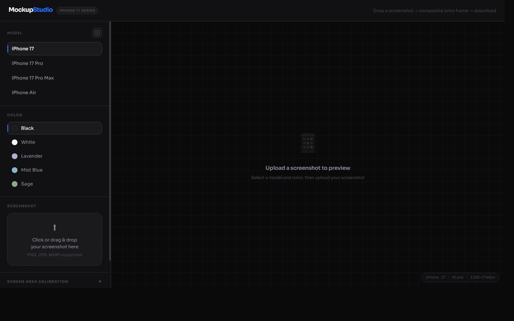

# MockupStudio — iPhone 17 Series

A browser-based tool for compositing screenshots onto iPhone frame PNGs. Select a model and color, upload a screenshot, and download a pixel-perfect mockup — no backend, no dependencies, no uploads.



## Live Demo

**[https://black-dune-0c2630400.7.azurestaticapps.net](https://black-dune-0c2630400.7.azurestaticapps.net)**

## Features

- 4 iPhone models: iPhone 17, iPhone 17 Pro, iPhone 17 Pro Max, iPhone Air
- 16 color variants across all models
- Pixel-perfect screen compositing via alpha-channel flood-fill masking
- Half-resolution preview for instant feedback; full-resolution compositing on download
- Off-thread detection via Web Worker — UI stays responsive during processing
- Result caching — switching between previously loaded frames is instant
- Collapsible sidebar on desktop; overlay drawer on mobile
- Floating open button on mobile so the sidebar is always accessible
- Auto-detects screen coordinates on first use (saved to `localStorage`)
- Pure client-side — no server, no uploads, no dependencies

## Usage

**Online:** [https://black-dune-0c2630400.7.azurestaticapps.net](https://black-dune-0c2630400.7.azurestaticapps.net)

**Local development:** Requires HTTP serving (not `file://`) due to browser CORS restrictions on `getImageData`.

```bash
python -m http.server 8080
# open http://localhost:8080
```

## Workflow

1. **Select model** — iPhone 17 / iPhone 17 Pro / iPhone 17 Pro Max / iPhone Air
2. **Select color** — color list updates automatically per model
3. **Upload screenshot** — click the upload area or drag and drop
4. **Preview** — composited result appears immediately at half resolution
5. **Download** — click "Download PNG" to produce a full-resolution output

Screen coordinates are auto-detected on first use and saved to `localStorage`. Use the **Screen Area Calibration** panel to re-detect or fine-tune manually.

## Supported Models and Colors

| Model | Colors |
|-------|--------|
| iPhone 17 | Black, White, Lavender, Mist Blue, Sage |
| iPhone 17 Pro | Cosmic Orange, Deep Blue, Silver |
| iPhone 17 Pro Max | Cosmic Orange, Deep Blue, Silver |
| iPhone Air | Cloud White, Light Gold, Sky Blue, Space Black |

## Performance Architecture

Preview and download use separate resolution pipelines:

| Phase | Resolution | When |
|-------|-----------|------|
| Preview | 50% (675×1380) | On frame load / color switch |
| Download | 100% (1350×2760) | On "Download PNG" click |

Pixel-level detection (flood-fill + mask construction) runs in a **Web Worker** so the main thread is never blocked. Results are cached per model+color — switching back to a previously loaded frame is instant with no recomputation.

## How Compositing Works

iPhone frame PNGs contain two kinds of transparent region (alpha ≈ 0):

- **Outer background** — outside the phone silhouette
- **Screen hole** — the display cutout inside the phone (squircle shape)

Simple alpha masking cannot distinguish between them. The pipeline solves this:

1. **Flood-fill from edges** — marks all outer background pixels
2. **Single-pass scan** — any remaining transparent pixel is the screen hole; opaque pixels define the frame bounding box
3. **Build pixel-perfect mask** — each inner pixel gets `maskAlpha = 255 − frameAlpha`, giving smooth anti-aliased squircle edges
4. **Composite** — draw screenshot → apply mask via `destination-in` → draw frame on top

Download cropping uses the frame bounding box (computed in the same scan) to strip transparent padding from the output PNG.

## Mobile UX

- Sidebar opens as a full-height overlay drawer with a blurred backdrop
- A floating button (outside the sidebar) is always visible so the drawer can be opened even when fully closed
- `overscroll-behavior: contain` prevents iOS rubber-band scroll from breaking the drawer
- `bottom: 0` positioning (instead of `height: 100vh`) avoids Safari's dynamic toolbar height bug
- Safe-area padding at the bottom accounts for the iPhone home indicator

## Project Structure

```
├── index.html          # UI layout
├── style.css           # Styles and responsive layout
├── app.js              # Application logic
├── detect-worker.js    # Web Worker — pixel detection off main thread
├── preview.png         # Desktop screenshot
├── preview-mobile.png  # Mobile screenshot
└── PNG/
    ├── iPhone 17/
    ├── iPhone 17 Pro/
    ├── iPhone 17 Pro Max/
    └── iPhone Air/
```

## Adding New Models

1. Place frame PNGs in `PNG/{model name}/` following the naming convention:
   ```
   {model name} - {color} - Portrait.png
   ```
2. Add an entry to `MODEL_COLORS` in `app.js`:
   ```js
   'iPhone XX': ['Color A', 'Color B'],
   ```
3. Add color swatches to `COLOR_SWATCHES` in `app.js`:
   ```js
   'Color A': '#rrggbb',
   ```
4. Add a model button to `index.html`:
   ```html
   <button class="model-btn" data-model="iPhone XX">iPhone XX</button>
   ```

Screen coordinates are auto-detected on first use — no manual calibration required.
